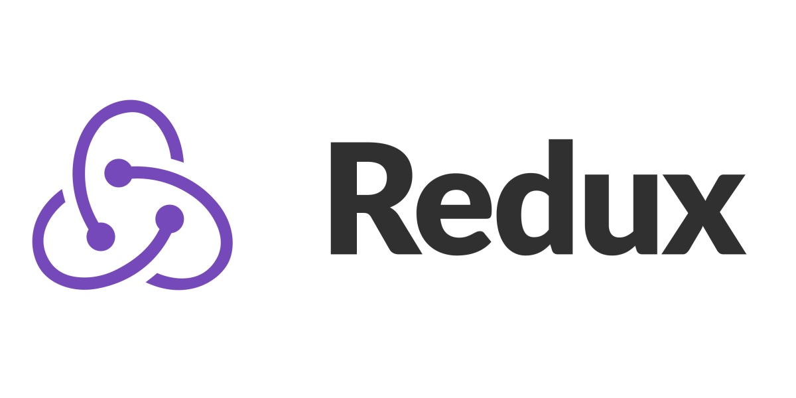
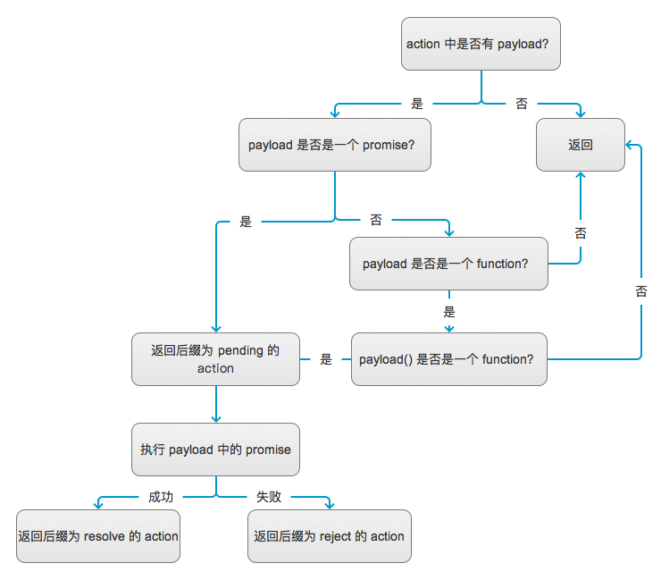

Redux 的应用给我们开发带来了很多便利，让组件间交互不再那么复杂，但 Redux 也有它的短板，我们知道要通过 Redux 改变一个 state 需要定义 actionType→action→reducer，这使得有时候一个很简单的交互都需要写一堆代码，我们今天要介绍的这个小插件可以让这个工作变得更加简洁、优雅。

它就是：[redux-promise-middleware](https://github.com/pburtchaell/redux-promise-middleware)，这是一个 Redux 的 middleware，引入项目的方式和其他的 redux middleware 一样，具体可以查看它的官方文档，这里就不再赘述。

举个典型的例子，通过 Redux 中发起一次登录请求，这个请求的 promise 会有3种状态需要我们处理，分别是 pending、resolve、reject，在 pending 的时候页面要显示等待状态，resolve 的时候要显示请求成功，reject 的时候要提示用户请求失败，我们先通过对比来看一下用了这个组件之后代码是什么样子：

**actionType.js**

使用前：

```js
export const LOGIN_PENDING = 'LOGIN_PENDING';
export const LOGIN_RESOLVE = 'LOGIN_RESOLVE';
export const LOGIN_REJECT = 'LOGIN_REJECT';
```

使用后：

```js
export const LOGIN = 'LOGIN';
```

只需要写一个？是的，让我们往下看。

**action.js**

使用前：

```js
import * as at from 'actionType';

export const login = (username, password) => async dispatch => {
  dispatch({ type: at.LOGIN_PENDING });
  try {
    const resp = await axios.post(URL_LOGIN, { username, password });
    dispatch({
      type: at.LOGIN_RESOLVE,
      result: resp
    });
  } catch(e) {
    dispatch({
      type: at.LOGIN_REJECT,
      message: e.message
    });
  }
}
```

使用后：

```javascript
import * as at from 'actionType';

export const login = (username, password) => ({
  type: at.LOGIN,
  payload: axios.post(URL_LOGIN, { username, password })
});
```

写完了？没错，就是这么简单。那等待和失败的处理在哪里呢？别急，咱们继续往下看。

**reducer.js**

使用前：

```js
import * as at from 'actionType';

export default (state, action) => {
  switch (action.type) {
    case at.LOGIN_PENDING:
      // 显示等待图标
    case at.LOGIN_RESOLVE:
      // 显示登录成功
    case at.LOGIN_REJECT:
      // 显示登录失败
  }
}
```

使用后：

```js
import { PENDING, FULFILLED, REJECTED } from 'redux-promise-middleware';
import * as at from 'actionType';

export default (state, action) => {
  switch (action.type) {
    case `${at.LOGIN}_${PENDING}`:
      // 显示等待图标
    case `${at.LOGIN}_${FULFILLED}`:
      // 显示登录成功
    case `${at.LOGIN}_${REJECTED}`:
      // 显示登录失败
  }
}
```

正如你所看到的，用了这个 middleware 后，一个带有 promise 的 action 会被包装成三个状态为后缀的 action 发给 reducer，并且**此时 action.payload 中的值已经是 promise 执行后返回的结果**，然后我们只需要拿 payload 的值分别操作 state 就行了。看到这里你应该觉得，嗯，这个插件确实能让人少写不少代码，但是反应快的朋友看了之后可能又有疑问了——在 action 里面只返回一个 type 和 payload 的对象，这在处理一个请求的时候确实没问题，那假如我在 login 之后紧接着又要 dispatch 另外一个 action 怎么办呢？

这个时候我们可以这样写：

```js
import * as at from 'actionType';

export const login = (username, password) => dispatch => {
  dispatch({
    type: at.LOGIN,
    payload: axios.post(URL_LOGIN, { username, password })
  }).then(() => dispatch(afterLogin()));
}
```

从笔者的使用经历来看，以上的写法基本能满足绝大多数的场景，此时有的同学可能依然有疑问——这个 middleware 这么擅自主张的就对 action 进行了改装，会不会对项目的入侵太大？如果我的项目已经进行到一半，再引入它会不会让我以前写的 action 无法正常被 reducer 接收到？这个答案让我们到它的源码中去寻找：

打开它的仓库地址，我们会发现它的代码很少，只有两个文件：`index.js`和`isPromise.js`，`isPromise.js` 定义了一个工具方法用来判断一个对象是否是一个 promise，这里就不再多讲。主要的逻辑在 `index.js` 中，为了节约你的时间，我们用一个流程图去大概描述它的逻辑：



值得一提的是，因为它是一个 Redux 的 middleware，`返回` 意味着将 action 传递给下一个 middleware，直到传递到 reducer 中。从图中可以看出，如果你不是按照它规定的格式书写 action，它会直接透传出去，因此它并不会对项目造成什么副作用（除非你以前的 action 中的对象就是有叫 payload 的属性，并通过 payload 直接把一个 promise 对象发给了 reducer，这种本身也是不规范的写法）。

除了文章中讲到的这些，redux-promise-middleware 还有许多其他的使用技巧帮助我们提高编码效率，同时很多属性也支持自定义，比如代表三种状态的 action 的后缀等等，感兴趣的同学可以下来自行阅读官方文档。
