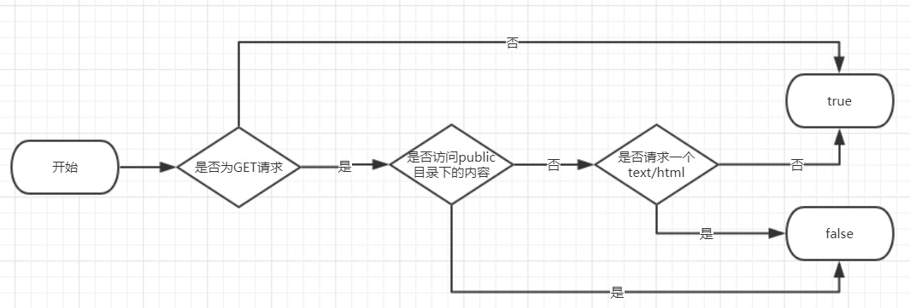

现在越来越多的 Web 项目都采取前后端分离的开发方式，也就是在开发过程中前端工程运行在一个 node server 上，同时提供 REST API 的后端工程作为独立的服务运行在另一个 server 上，这样前后端通过 HTTP 请求进行通信的时候就会遇到跨域的问题，跨域是怎么一回事大家应该都了解，这里就不再赘述。以往解决跨域问题比较常用的方法就是给服务端配置 CORS，但是这种方式会带来一些不便：

1. 要修改后端代码，如果后端项目运行在自己机器上还好，如果是运行在别的服务器上，甚至是其他团队在维护，那么修改一段代码就会比较麻烦，并且还要确保这些代码不会被发布到生产环境中去。
2. 每次启动浏览器的时候要输入一长串代码来关闭浏览器的安全策略，比如 Chrome 浏览器的命令如下：
   `open -a /Applications/Google\ Chrome.app --args --disable-web-security --user-data-dir`
   不仅麻烦，万一一不小心在这种模式下访问了一些敏感的数据，还会带来安全隐患。
3. 开发模式下前端调接口要带上测试后端服务器的 URL，因此发布到生产环境之前还要把它去掉。

总之就是比较麻烦，体会不到那种脱了裤子就上，完事提上裤子就走的爽快感，我说的是上厕所。所以今天就是要介绍一种更加简单安全的解决方案，同时我们会深入去了解其中的原理是什么。

首先，用 [create-react-app](https://github.com/facebook/create-react-app) 创建一个前端项目，假如你的前端项目运行的地址是 `http://localhost:3000`，与此同时提供 API 的后端项目运行的地址是 `http://localhost:4000`，你要做的只是在前端工程的 package.json 文件中添加这样一行配置：

```json
"proxy": "http://localhost:4000"
```

然后你就会神奇地发现，从前端页面发出的 HTTP 请求，虽然访问的依然是 3000 端口，但是会被自动转发到 4000 端口的后端服务器并得到正确的响应，于此同时访问页面的请求却不会被转发，依然能够被前端路由捕获，这样我们就完全不需要再考虑如何处理跨域的问题了。问题是解决了，但是又出现了 2 个问题萦绕在我的心中：

1. package.json 中的 `proxy` 参数是作用在什么地方的？
2. 是怎么样做到把访问页面的请求和访问 REST API 的请求区分开的？

带着这样的疑问我们一起去看看 **create-react-app** 的源码是怎样写的，首先在前端项目中的 package.json 里我们能看到，项目启动执行的脚本是 `react-script start`，所以我们打开文件 [create-react-app/packages/react-scripts/scripts/start.js](https://github.com/facebook/create-react-app/blob/next/packages/react-scripts/scripts/start.js?1521341168780)（为何直接能定位到这个文件，以及 react-script 这个命令是如何注册的，属于其他知识点，本文不展开说明，有疑问的童鞋可以去[这里](https://docs.npmjs.com/files/package.json#bin) 学习一个），我们看到有以下代码：

```js
// Load proxy config
const proxySetting = require(paths.appPackageJson).proxy;
const proxyConfig = prepareProxy(proxySetting, paths.appPublic);
// Serve webpack assets generated by the compiler over a web sever.
const serverConfig = createDevServerConfig(
    proxyConfig,
    urls.lanUrlForConfig
);
const devServer = new WebpackDevServer(compiler, serverConfig);
```

此处的 ```paths.appPackageJson``` 的声明在 [create-react-app/packages/react-scripts/config/paths.js](https://github.com/facebook/create-react-app/blob/next/packages/react-scripts/config/paths.js?1521342791455) 中：

```js
module.exports = {
  appPackageJson: resolveApp('package.json'),
};
```

因此我们就知道，这里的 `proxySetting` 就是我们之前在前端工程的 package.json 中定义的 `proxy` 的值，然后我们看到，`proxySetting` 被用来生成了 `serverConfig`，最终 `serverConfig` 作为配置参数创建了 `WebpackDevServer` 实例。[webpack-dev-server](https://github.com/webpack/webpack-dev-server) 是一个用于启动 webpack 的测试服务器，并且提供了诸如 HMR 等方便开发的功能，因此我们就得出第一个结论：**前端工程的 package.json 中定义的 `proxy` 值，是作用于 WebpackDevServer，最终通过 WebpackDevServer 进行的转发**。

让我们继续试图解答第二个问题——是怎么样做到把访问页面的请求和访问 REST API 的请求区分开的？我们看到 `proxySetting` 首先是被传入 `prepareProxy` 方法得到 `proxyConfig`，然后在 `createDevServerConfig` 方法中返回了一个对象，并且对象的 `proxy` 字段的值为 `proxyConfig`，最终该对象就是 webpack-dev-server 的配置项，在 [webpack-dev-server 文档](https://webpack.js.org/configuration/dev-server/#devserver-proxy) 中可以看到 proxy 的作用就是做一层代理，把从页面来的请求转发到另一个地址，因此关键就在于 `proxyConfig` 的配置是怎么样的，于是目光转移到 `prepareProxy` 方法，`prepareProxy` 方法的定义在 [create-react-app/packages/react-dev-utils/WebpackDevServerUtils.js](https://github.com/facebook/create-react-app/blob/next/packages/react-dev-utils/WebpackDevServerUtils.js?1521357351270#L266) 中，在这里我们可以看到首先是对 `proxy` 进行了类型和格式的检测，然后如果 `proxy` 是一个格式正确的字符串，就返回一个只有一个对象元素的数组，在这个对象中的 `context` 字段中出现了如下的判断：

```js
context: function(pathname, req) {
    return (
        req.method !== 'GET' ||
        (mayProxy(pathname) &&
         req.headers.accept &&
         req.headers.accept.indexOf('text/html') === -1)
    );
}
```

在这里我们看到有对 ```req.headers.accept``` 进行判断，```req.headers.accept``` 用于表示浏览器通过这次 HTTP 请求希望获取到的内容类型，因此如果 accept 中带有 `text/html` 则说明本次请求获取的是一个 document，因此就不应该被转发到后端，这一堆判断逻辑用一幅图表示出来如下：



在这里 context 的含义在 webpack-dev-server 文档中是找不到的，它的说明出现在 [**http-proxy-middleware**]() 中，context 支持传入一个 function 用于自定义转发的逻辑，只在返回值为 true 时才转发请求，**因此该代理将只会转发 ajax 或者 fetch 发出的 HTTP 请求 。**

除了文中提到的这种最简单的配置，webpack-dev-server 的 proxy 还支持多种配置方式以同时满足多种代理规则，感兴趣的同学可以去文档里面了解更多细节。